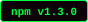
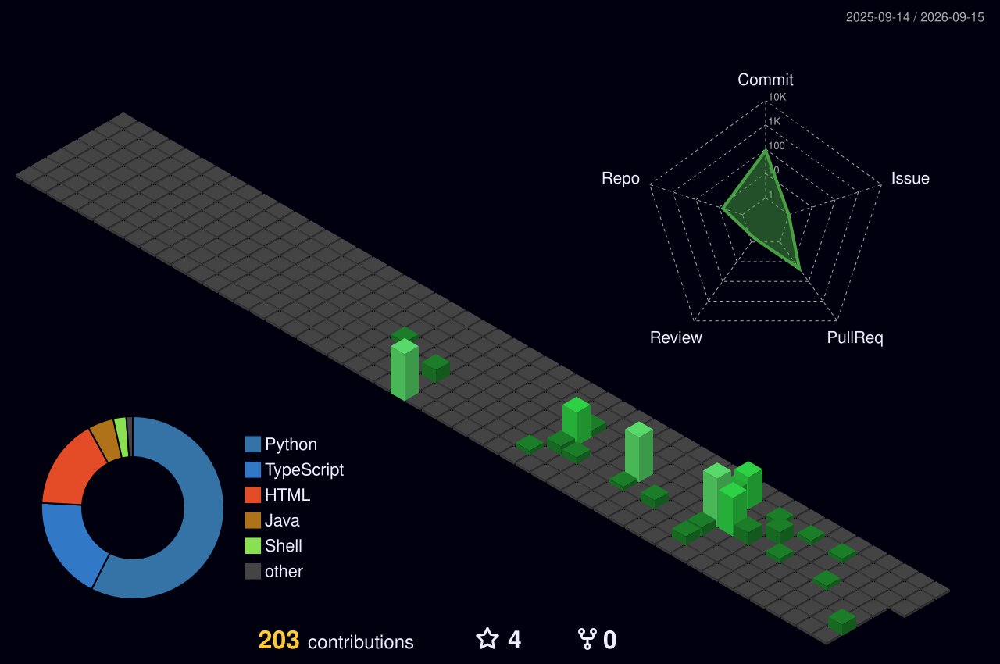

<!-- =========================================================
       black-astro  ·  GitHub Profile README   (hacker / terminal theme)
     ========================================================= -->

<div align="center">


<!-- 움직이는 소개 텍스트 -->
<a href="https://git.io/typing-svg">
  
</a>

<br/>


<a href="https://black-astro.github.io/black-astro/"></a>
<a href="mailto:gntj3200@gmail.com"></a>

</div>

<div align="center">
<sub>📖 <b>이력서 · 경력기술서 · 포트폴리오</b> 블로그 → <a href="https://black-astro.github.io/black-astro/">black-astro.github.io/black-astro</a> &nbsp;·&nbsp; <code>Vue 3 · TypeScript · Vite</code></sub>
</div>

<div align="center">
<sub>🌙 이 프로필은 <b>다크(블랙) 테마</b>에 맞춰 디자인했습니다 — <b>GitHub 다크 모드</b>에서 가장 잘 보입니다.</sub>
</div>

<br/>

<div align="center">

</div>

---


&nbsp;
&nbsp;
&nbsp;
&nbsp;


| 구분 | 내용 |
|------|------|
| **대용량 처리** | StAX 스트리밍 파싱 · MyBatis `ExecutorType.BATCH`(청크 flush) · 파서 풀 + 단일 라이터 파이프라인으로 1GB+ XML을 OOM 없이 ETL |
| **인증/인가 설계** | 단일 백엔드에서 클라이언트 3종을 멀티 `SecurityFilterChain`으로 분리, JWT 발급·검증 분리, 클라이언트별 토큰 정책 운영 |
| **외부 API 연동** | Spring 6 RestClient 기반 카카오 전자문서 게이트웨이·SKT PASS지갑 IF 연동, 타임아웃 정밀 분기(504/500), 발송 상태머신 설계 |
| **동시성 / 스케줄러** | `ThreadPoolTaskScheduler` N-스레드 분산 발송, MOD 기반 다중 스케줄러, `@PreDestroy` graceful shutdown |
| **운영 안정성** | 발송 상태머신 · 스케줄러 race를 DB 원자성으로 차단, 운영 사고를 SQL로 재현·복구 후 문서화(재발 방지) |
| **DB / SQL** | JPA · QueryDSL · MyBatis 혼용, Tibero·Oracle PL/SQL 프로시저·UDF, MERGE UPSERT, 동적 인덱스 제어, SQL 튜닝 |
| **빌드/품질 자동화** | Jenkins Pipeline · SonarQube Quality Gate · JaCoCo · CycloneDX SBOM · WAR/JAR 동시 빌드 |
| **인프라 직접 구축** | VMware OS 설치부터 Docker 기반 Gitea · Jenkins · SonarQube(Community) · Nginx + PostgreSQL 사내 CI/CD 환경을 단독 구축·운영 (CentOS / Ubuntu, Apache · Nginx) |
| **Full-stack** | 관리자 콘솔 JSP → Vue2 → Vue3 3세대 전환, Electron 데스크톱까지 — 백엔드 계약(엔드포인트·토큰) 기준으로 프론트를 직접 연동 |

<br/>

---


**Backend**


**Data & Persistence**


**Security · API**


**Batch · Concurrency · Quality**


**Frontend**


**Infra & DevOps** _(사내 CI/CD 환경 직접 구축·운영)_


**Tools**


**학습 중** _(개인 프로젝트로 직접 구현하며 익히는 중 — 실무 적용 경험과 구분해 표기합니다)_


-6DB33F?style=for-the-badge&logo=spring&logoColor=white)


<br/>

---


### [`easy-quartz`](https://github.com/black-astro/easy-quartz) · Spring Boot Starter

&nbsp;
&nbsp;


어노테이션(`@EasyQuartzScheduled`) 기반으로 **5종 스케줄 × 2엔진(Quartz / Spring TaskScheduler)**을 단일 추상화로 통합한 Spring Boot Starter. `Maven Central` 배포.

- `autoconfigure` / `starter` / `sample` 3-tier 멀티모듈, SPI 기반 Auto-Configuration
- AOP 프록시 우회 문제를 `getBean()` + `AopUtils.getTargetClass()` 시그니처 검사로 해결(트랜잭션·캐시 보존)
- 태그 push → GPG 서명 → Sonatype Central 배포까지 릴리즈 파이프라인 무인 자동화

```gradle
implementation "io.github.black-astro:easy-quartz-spring-boot-starter:0.0.2"
```

### [`smart-msg`](https://github.com/black-astro/smart-msg) · AI Commit CLI

&nbsp;
&nbsp;


다중 LLM(OpenAI · Claude · Gemini · Groq · Ollama)을 지원하는 **AI Git 커밋 메시지 생성 CLI**. `npm` 배포, Conventional Commits · 한/영 출력 지원.

```bash
npm install -g smart-msg   # 사용: sm
```

### [`code T`](https://github.com/black-astro/coding-test) · 코딩테스트 데스크톱 앱

&nbsp;


**PySide6** 기반 코딩 테스트 연습 데스크톱 앱. 문법→자료구조→알고리즘 단계 학습, **문제 357**(코딩테스트 326 · SQL 실전 50제 포함 / 데이터분석 31) · **강의 212**(문법 155 / 데이터분석 57) 수록, **케이스별 실행 시간(ms)·최대 메모리까지 측정하는 자동 채점** (Python · Java · C++ · JS).

> 그 외 — `shadowport` : 레거시 리버스 터널 도구를 Java 21 · Netty · AES-GCM / X25519 · JavaFX로 재설계한 네트워크·보안 사이드 프로젝트 (비공개)

<br/>

---


> 비공개 사내/개인 저장소는 도메인 중심으로 요약했습니다.

#### 실시간 상담·모니터링 백엔드
`Java 21` · `Spring Boot 3.x` · `Spring Data JPA` · `QueryDSL` · `WebSocket` · `MariaDB` · `Tibero`
- 도메인 패키지 구조(DDD 지향) 기반 계층 분리, JPA + QueryDSL 커스텀 리포지토리로 타입 안전한 동적 조회 구성
- WebSocket 실시간 상태 전송에 인증 인터셉터를 붙여 비인가 구독 차단, 이기종 멀티 DataSource 분리
- 메뉴 계층·권한 로직에 Mockito·AssertJ 단위 테스트 작성 — MyBatis 중심 조직에 테스트 관행 도입

#### 대용량 명세서 배치 (ETL) — 델파이 레거시 재구축
`Java 21` · `Spring Boot 3.4` · `StAX / JAXB` · `MyBatis BATCH` · `Tibero PL/SQL` · `Spring Integration SFTP`
- 규모별 파싱 전략 분리 — 텍스트(BufferedReader) / 중규모(JAXB) / 대규모(StAX 상태머신)
- 파서 스레드 풀 + `ArrayBlockingQueue` backpressure + 단일 라이터로 커밋 경합 제거(poison pill 종료 전파)
- 적재 전 인덱스 `UNUSABLE` → BATCH 청크 적재 → `REBUILD` + `DBMS_STATS`로 실행계획 회복
- 중복제거 프로시저를 커서 루프에서 집합 기반(`MERGE`)으로 재설계 — **INSERT 50분→25분, 프로시저 5시간→2시간**(운영 실측)

#### 카카오 전자문서 발송 서버
`Java 21` · `Spring Boot 3.3` · `RestClient` · `MyBatis 동적 SQL` · `Tibero`
> 카카오 전자문서(모바일 전자고지) 게이트웨이 연동 — 수신자는 카카오톡 알림으로 안내를 받고 링크로 열람
- 발송/결과/정산을 단일 상태 컬럼(N→B→P→S) 상태머신으로 추적
- 외부 API 호출을 트랜잭션 경계 밖으로 분리, `WHERE` 상태 조건으로 스케줄러 race를 DB 원자성으로 차단
- 멱등 INSERT(`WHERE NOT EXISTS`), 무중단 Switch ON/OFF, 운영 사고 SQL 재현·복구 후 문서화

#### 본인인증(PASS) 발송
`Java 21` · `Spring Boot 3.4` · `ThreadPoolTaskScheduler` · `Log4j2(Disruptor)` · `Jasypt`
- N-스레드 stagger 분산 발송, `@PreDestroy` graceful cancel
- Jenkins Pipeline(Unit→Integration→SonarQube Quality Gate→Build) + CycloneDX SBOM 자동 산출

#### 통합 인증 백엔드
`Java 8` · `Spring Security / OAuth2` · `MyBatis 멀티 DataSource` · `Caffeine`
- 클라이언트 3종을 `@Order` + antMatcher로 `SecurityFilterChain` 분리 운영
- Access/Refresh 토큰 수명 분리, `type` 클레임 검증, 도메인별 DataSource·TransactionManager 분리

#### 데스크톱 클라이언트 (Electron)
`Electron 39` · `Vue3` · `Vuetify` · `Pinia` · `better-sqlite3` · `STOMP` · `electron-updater` · `NSIS`
- 두 개의 백엔드 토큰을 핸드오프/자동 갱신으로 연동, 동시 요청 시 리프레시 중복 방지
- `better-sqlite3`를 Worker 전용 접근으로 격리, `contextIsolation` 기반 렌더러 보안 적용
- `electron-updater` 자동 업데이트 + NSIS 설치 패키징으로 운영 배포 자동화

<br/>

---


<div align="center">


<br/><br/>



</div>

<br/>

<div align="center">


</div>
