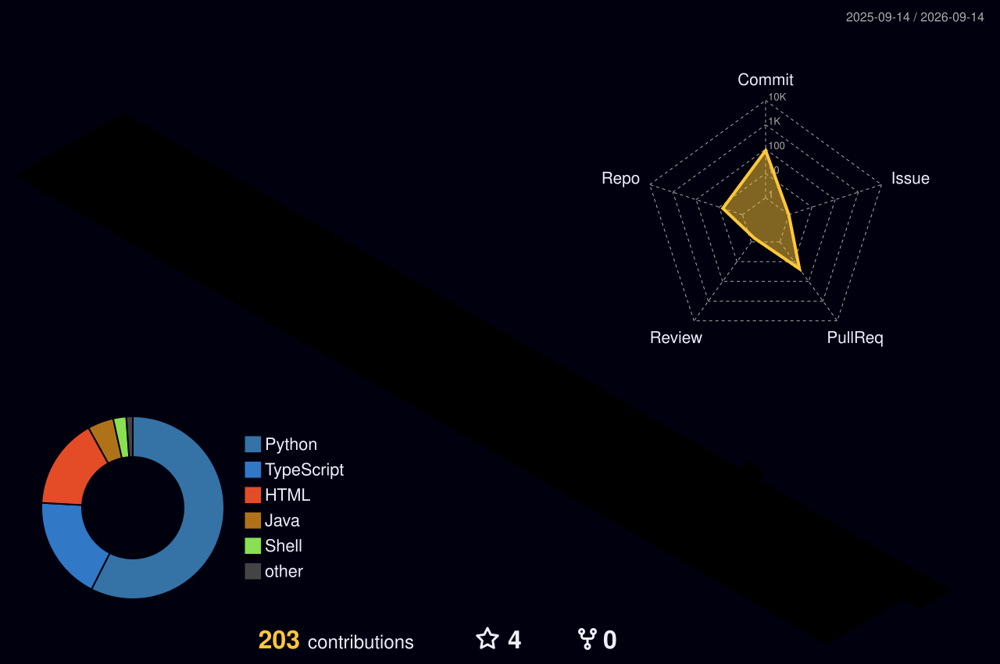

<!-- =========================================================
       black-astro  ·  GitHub Profile README
     ========================================================= -->

<div align="center">


<!-- 움직이는 소개 텍스트 -->
<a href="https://git.io/typing-svg">
  
</a>

<br/>


<a href="mailto:gntj3200@gmail.com"></a>

</div>

<br/>

---

## 👤 Core Competencies

| 구분 | 내용 |
|------|------|
| **대용량 처리** | StAX 스트리밍 파싱 · MyBatis `ExecutorType.BATCH`(청크 flush) · Java 21 Virtual Thread 병렬화로 대용량 XML을 OOM 없이 ETL |
| **인증/인가 설계** | 단일 백엔드에서 클라이언트 3종을 멀티 `SecurityFilterChain`으로 분리, JWT 발급·검증 분리, 클라이언트별 토큰 정책 운영 |
| **외부 API 연동** | Spring 6 RestClient 기반 카카오 비즈톡·PASS 인증사 연동, 타임아웃 정밀 분기(504/500), 발송 상태머신 설계 |
| **동시성 / 스케줄러** | `ThreadPoolTaskScheduler` N-스레드 분산 발송, MOD 기반 다중 스케줄러, `@PreDestroy` graceful shutdown |
| **운영 안정성** | 발송 상태머신 · 스케줄러 race를 DB 원자성으로 차단, 운영 사고를 SQL로 재현·복구 후 문서화(재발 방지) |
| **DB / SQL** | JPA · QueryDSL · MyBatis 혼용, Tibero·Oracle PL/SQL 프로시저·UDF, MERGE UPSERT, 동적 인덱스 제어, SQL 튜닝 |
| **빌드/품질 자동화** | Jenkins Pipeline · SonarQube Quality Gate · JaCoCo · CycloneDX SBOM · WAR/JAR 동시 빌드 |
| **인프라 직접 구축** | VMware OS 설치부터 Docker 기반 Gitea · Jenkins · SonarQube(Community) · Nginx + PostgreSQL 사내 CI/CD 환경을 단독 구축·운영 (CentOS / Ubuntu, Apache · Nginx) |
| **Full-stack** | Vue3 · Nuxt · Electron 데스크톱까지, 백엔드 계약(엔드포인트·토큰) 기준으로 프론트를 직접 연동 |

<br/>

---

## 🧰 Tech Stack

<div align="center">

**Backend**


**Data & Persistence**


-DC382D?style=for-the-badge&logoColor=white)


**Security · API · Resilience**


**Batch · Concurrency · Quality**


-D22128?style=for-the-badge&logoColor=white)


**Frontend**


**Infra & DevOps** _(사내 CI/CD 환경 직접 구축·운영)_


**Tools**


</div>

<br/>

---

## 🚀 Open Source

<div align="center">

<a href="https://github.com/black-astro/easy-quartz">
  
</a>
<a href="https://github.com/black-astro/smart-msg">
  
</a>
<a href="https://github.com/black-astro/coding-test">
  
</a>

</div>

**[`easy-quartz`](https://github.com/black-astro/easy-quartz)** — 어노테이션(`@EasyQuartzScheduled`) 기반으로 **5종 스케줄 × 2엔진(Quartz / Spring TaskScheduler)**을 단일 추상화로 통합한 Spring Boot Starter. `Maven Central` 배포.

- `autoconfigure` / `starter` / `sample` 3-tier 멀티모듈, SPI 기반 Auto-Configuration
- AOP 프록시 우회 문제를 `getBean()` + `AopUtils.getTargetClass()` 시그니처 검사로 해결(트랜잭션·캐시 보존)
- 태그 push → GPG 서명 → Sonatype Central 배포까지 릴리즈 파이프라인 무인 자동화

```gradle
implementation "io.github.black-astro:easy-quartz-spring-boot-starter:0.1.0"
```

**[`smart-msg`](https://github.com/black-astro/smart-msg)** — 다중 LLM(OpenAI · Claude · Gemini · Groq · Ollama)을 지원하는 **AI Git 커밋 메시지 생성 CLI**. `npm` 배포, Conventional Commits · 한/영 출력 지원.

```bash
npm install -g smart-msg   # 사용: sm
```

**[`code T`](https://github.com/black-astro/coding-test)** — **PySide6** 기반 코딩 테스트 연습 데스크톱 앱. 문법→자료구조→알고리즘 단계 학습, 문제 276·문법 강의 149 수록, **케이스별 실행 시간(ms)·최대 메모리까지 측정하는 자동 채점** (Python · Java · C++ · JS).

> 그 외 — `shadowport` : 레거시 리버스 터널 도구를 Java 21 · Netty · AES-GCM / X25519 · JavaFX로 재설계한 네트워크·보안 사이드 프로젝트 (비공개)

<br/>

---

## ⚙️ Projects

> 비공개 사내/개인 저장소는 도메인 중심으로 요약했습니다.

#### 실시간 상담·모니터링 백엔드
`Java 21` · `Spring Boot 3.x` · `Spring Data JPA` · `QueryDSL` · `Resilience4j` · `WebSocket` · `MariaDB`
- 도메인 패키지 구조(DDD 지향) 기반 계층 분리, JPA + QueryDSL로 동적 조회 구성
- Resilience4j Circuit Breaker로 외부 연동 장애 격리, WebSocket 실시간 상태 전송
- Caffeine 캐시 · 비동기 로깅(Log4j2 Disruptor) 적용

#### 대용량 명세서 배치 (ETL)
`Java 21` · `Spring Boot 3.4` · `StAX / JAXB` · `MyBatis BATCH` · `Tibero PL/SQL` · `Spring Integration SFTP`
- 규모별 파싱 전략 분리 — 텍스트(BufferedReader) / 중규모(JAXB) / 대규모(StAX 상태머신)
- Virtual Thread + Semaphore로 병렬 상한 제어, MyBatis BATCH 청크 단위 flush
- 적재 전 인덱스 `UNUSABLE` → 대량 적재 → `REBUILD` + `DBMS_STATS`로 실행계획 회복

#### 알림톡 발송 서버
`Java 21` · `Spring Boot 3.3` · `RestClient` · `MyBatis 동적 SQL` · `Tibero`
- 발송/결과/정산을 단일 상태 컬럼(N→B→P→S) 상태머신으로 추적
- 외부 API 호출을 트랜잭션 경계 밖으로 분리, `WHERE` 상태 조건으로 스케줄러 race를 DB 원자성으로 차단
- 멱등 INSERT(`WHERE NOT EXISTS`), 무중단 Switch ON/OFF, 운영 사고 SQL 재현·복구 후 문서화

#### 본인인증(PASS) 발송
`Java 21` · `Spring Boot 3.4` · `ThreadPoolTaskScheduler` · `Log4j2(Disruptor)` · `Jasypt`
- N-스레드 stagger 분산 발송, `@PreDestroy` graceful cancel
- Jenkins Pipeline(Unit→Integration→SonarQube Quality Gate→Build) + CycloneDX SBOM 자동 산출

#### 통합 인증 백엔드 · 데스크톱 클라이언트
`Java 8` · `Spring Security / OAuth2` · `MyBatis 멀티 DataSource` · `Electron` · `Vue3`
- 클라이언트 3종을 `@Order` + antMatcher로 `SecurityFilterChain` 분리, 도메인별 DataSource 운영
- Electron(Vue3 · Pinia · STOMP · electron-updater) 데스크톱에서 이중 백엔드 토큰 핸드오프 연동

<br/>

---

## 📊 GitHub Activity

<div align="center">


<br/>


<br/><br/>

<picture>
  <source media="(prefers-color-scheme: dark)" srcset="https://raw.githubusercontent.com/black-astro/black-astro/output/github-snake-dark.svg"/>
  <source media="(prefers-color-scheme: light)" srcset="https://raw.githubusercontent.com/black-astro/black-astro/output/github-snake.svg"/>
  
</picture>

<br/><br/>



</div>

<br/>

<div align="center">


</div>
