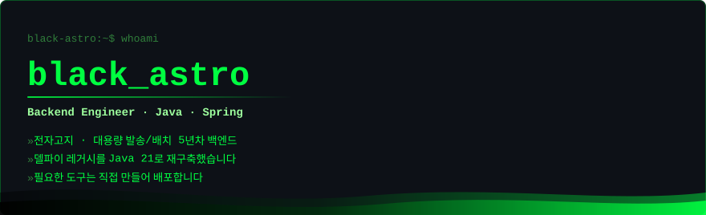

<!-- =========================================================
       black-astro  ·  GitHub Profile README   (hacker / terminal theme)
     ========================================================= -->

<div align="center">

<!-- 헤더 — 자체 SVG. 외부 렌더러는 GitHub 프록시에서 글자가 날아가 직접 그린다 -->


<br/>

<!-- 포트폴리오 — 이 프로필의 본문입니다 -->
<a href="https://black-astro.github.io/black-astro/">
  
</a>

<br/>

<a href="https://black-astro.github.io/black-astro/#/career"></a>
<a href="https://black-astro.github.io/black-astro/#/portfolio"></a>
<a href="https://black-astro.github.io/black-astro/#/oss"></a>
<a href="mailto:gntj3200@gmail.com"></a>


</div>

<div align="center">
<sub>🌙 다크 테마 기준으로 디자인했습니다 — <b>GitHub 다크 모드</b>에서 가장 잘 보입니다.</sub>
</div>

<br/>

<div align="center">

</div>

---


| 구분 | 내용 |
|:---|:---|
| **대용량 처리** | StAX 스트리밍 파싱 · MyBatis `ExecutorType.BATCH`(청크 flush) · 파서 풀 + 단일 라이터 파이프라인으로 1GB+ XML을 OOM 없이 ETL |
| **인증 / 인가 설계** | 단일 백엔드에서 클라이언트 3종을 멀티 `SecurityFilterChain`으로 분리, JWT 발급·검증 분리, 클라이언트별 토큰 정책 운영 |
| **외부 API 연동** | Spring 6 RestClient 기반 카카오 전자문서 게이트웨이·SKT PASS지갑 IF 연동, 타임아웃 정밀 분기(504/500), 발송 상태머신 설계 |
| **동시성 / 스케줄러** | `ThreadPoolTaskScheduler` 잡별 전용 풀 + 워커 샤딩 분산 발송, 정의표(enum) 기반 스케줄러, `@PreDestroy` graceful shutdown |
| **운영 안정성** | 발송 상태머신 · 스케줄러 race를 DB 원자성으로 차단, 운영 사고를 SQL로 재현·복구 후 문서화(재발 방지) |
| **DB / SQL** | JPA · QueryDSL · MyBatis 혼용, Tibero·Oracle PL/SQL 프로시저·UDF, MERGE UPSERT, 동적 인덱스 제어, SQL 튜닝 |
| **빌드 / 품질 자동화** | Jenkins Pipeline · SonarQube Quality Gate · JaCoCo · CycloneDX SBOM · WAR/JAR 동시 빌드 |
| **인프라 직접 구축** | VMware OS 설치부터 Docker 기반 Gitea · Jenkins · SonarQube(Community) · Nginx + PostgreSQL 사내 CI/CD 환경을 단독 구축·운영 (CentOS / Ubuntu, Apache · Nginx) |
| **Full-stack** | 관리자 콘솔 JSP → Vue2 → Vue3 3세대 전환, Electron 데스크톱까지 — 백엔드 계약(엔드포인트·토큰) 기준으로 프론트를 직접 연동 |

<br/>

---


**Backend**


**Data & Persistence**


**Security · API**


**Batch · Concurrency · Quality**


**Frontend**


**Infra & DevOps** _(사내 CI/CD 환경 직접 구축·운영)_


**Tools**


**학습 중** _(개인 프로젝트로 직접 구현하며 익히는 중 — 실무 적용 경험과 구분해 표기합니다)_


-6DB33F?style=for-the-badge&logo=spring&logoColor=white)

<br/>

---


### [`easy-quartz`](https://github.com/black-astro/easy-quartz) · Spring Boot Starter

&nbsp;
&nbsp;


어노테이션(`@EasyQuartzScheduled`) 기반으로 **5종 스케줄 × 2엔진(Quartz / Spring TaskScheduler)**을 단일 추상화로 통합한 Spring Boot Starter. `Maven Central` 배포.

- `autoconfigure` / `starter` / `sample` 3-tier 멀티모듈, SPI 기반 Auto-Configuration
- AOP 프록시 우회 문제를 `getBean()` + `AopUtils.getTargetClass()` 시그니처 검사로 해결(트랜잭션·캐시 보존)
- 태그 push → GPG 서명 → Sonatype Central 배포까지 릴리즈 파이프라인 무인 자동화

```gradle
implementation "io.github.black-astro:easy-quartz-spring-boot-starter:0.0.2"
```

### [`smart-msg`](https://github.com/black-astro/smart-msg) · AI Commit CLI

&nbsp;
&nbsp;


다중 LLM(OpenAI · Claude · Gemini · Groq · Ollama)을 지원하는 **AI Git 커밋 메시지 생성 CLI**. `npm` 배포, Conventional Commits · 한/영 출력 지원.

```bash
npm install -g smart-msg   # 사용: sm
```

### [`code T`](https://github.com/black-astro/coding-test) · 코딩테스트 데스크톱 앱

&nbsp;


**PySide6** 기반 코딩 테스트 연습 데스크톱 앱. 문법→자료구조→알고리즘 단계 학습, **문제 357**(코딩테스트 326 · SQL 실전 50제 포함 / 데이터분석 31) · **강의 212**(문법 155 / 데이터분석 57) 수록, **케이스별 실행 시간(ms)·최대 메모리까지 측정하는 자동 채점** (Python · Java · C++ · JS).

> 그 외 — `shadowport` : 레거시 리버스 터널 도구를 Java 21 · Netty · AES-GCM / X25519 · JavaFX로 재설계한 네트워크·보안 사이드 프로젝트 (비공개)

<br/>

---


> 비공개 사내/개인 저장소는 도메인 중심으로 요약했습니다.

#### 대용량 명세서 배치 (ETL) — 델파이 레거시 재구축
`Java 21` · `Spring Boot 3.4.5` · `StAX / JAXB` · `MyBatis BATCH` · `Tibero PL/SQL` · `SQLite` · `Spring Integration SFTP`
- 규모별 파싱 전략 분리 — 텍스트(BufferedReader) / 중규모(JAXB) / 대규모(StAX 상태머신)
- 파서 스레드 풀 + `ArrayBlockingQueue` backpressure + 단일 라이터로 커밋 경합 제거(poison pill 종료 전파)
- 적재 전 인덱스 `UNUSABLE` → BATCH 청크 적재 → `REBUILD` + `DBMS_STATS`로 실행계획 회복
- 중복제거 프로시저를 커서 루프에서 집합 기반(`MERGE`)으로 재설계하고 복합인덱스 선두 컬럼을 바꿔 완료 행을 스캔에서 제외 — 시간은 줄었지만 자릿수는 그대로여서 이 경로를 결국 버렸다(현재 미사용)
- **SQL 튜닝의 한계를 구조 변경으로 돌파** — 병목을 *연산의 위치* 문제로 재정의. 중복 판정에 필요한 컬럼이 4개뿐이라는 점에 착안해, 1,000만 행 DB 테이블이 아니라 **4컬럼짜리 로컬 SQLite**에서 윈도우 함수 한 번(20초)으로 끝내고 확정값으로 1회 적재. 프로시저 호출과 사후 UPDATE 조인이 통째로 사라짐 → **적재 50분 + 중복제거 4시간이던 구간이 전 구간 약 31분**(동일 규모 실데이터 실측)
- 잔여 병목은 스레드 덤프 샘플링 + 구간별 계측으로 규명 — `${}` 치환이 행마다 SQL 문자열을 바꿔 MyBatis BATCH 묶임을 깨뜨리던 문제를 찾아 **적재 파일당 44초 → 0.8초**(동일 규모 실데이터 실측)
- 적재 모드를 스위치로 분기 — 단일 모드는 direct-path(`APPEND_VALUES`), 병렬 모드는 파서 N스레드 + 단일 라이터에 일반 INSERT로 갈라 붙여 회차 상황에 맞게 선택
- 인덱스는 적재가 끝난 뒤에 만들고, 회차마다 버려지는 임시 스토어는 저널·동기화를 꺼서 내구성 대신 속도를 택함 — URL 채번이 건수 제곱으로 느려지던 것도 전용 인덱스로 선형화
- **구조 재편 5단계(68파일 +1,241/−1,935 · 순 −694줄)** — 기술 레이어 축으로 흩어져 있던 설정·DAO·스케줄러를 안내문 코드 도메인 축으로 재배치하고, 미사용 클래스와 죽은 SQL 10문을 제거. 하드코딩 매퍼 문자열을 걷어내 "DAO 메서드명 = XML id = 문자열" 3중 동기화를 2중으로 축소. **SQL 본문·프로시저·테이블/컬럼명은 불변**으로 두고 단계마다 컴파일 검증해 동작은 그대로 유지


#### 카카오 전자문서 발송 서버
`Java 21` · `Spring Boot 3.3` · `RestClient` · `MyBatis 동적 SQL` · `Tibero`
> 카카오 전자문서(모바일 전자고지) 게이트웨이 연동 — 수신자는 카카오톡 알림으로 안내를 받고 링크로 열람
- **초당 상한(200문서/초) 대응 페이서를 라이브러리 없이 15줄로 구현** — 카운터나 시간 윈도우 대신 "다음 발송 가능 시각" 하나만 들고 문서 수만큼 미래 슬롯을 예약. **예약 계산은 잠금 안, 대기는 잠금 밖**에 둬 스케줄러 3개가 서로를 막지 않고 슬롯을 나눠 갖는다
- 워커당 한도를 쪼개지 않고 **공유 페이서 단일 지점을 통과** — 유휴 워커가 있어도 처리량 손실 없음. 아침 버스트 2~3만 건을 **2.5~3분에 평탄하게 드레인**, 평상시엔 대기 0
- 속도조절을 **상태 선점보다 앞에 배치**해 대기 중 장애가 나도 중복 발송이 불가능하게 순서를 설계. 건당 과금이라 실패는 자동 재시도 대신 보류 + 사유 기록으로 정책화
- 발송/결과/정산을 단일 상태 컬럼(N→B→P→S) 상태머신으로 추적
- 외부 API 호출을 트랜잭션 경계 밖으로 분리, `WHERE` 상태 조건으로 스케줄러 race를 DB 원자성으로 차단
- 멱등 INSERT(`WHERE NOT EXISTS`), 무중단 Switch ON/OFF, 운영 사고 SQL 재현·복구 후 문서화


#### 본인인증(PASS) 발송
`Java 21` · `Spring Boot 3.4` · `MyBatis` · `RestClient` · `ThreadPoolTaskScheduler` · `Log4j2(Disruptor)` · `Jasypt`
- **번호기반(MDN) 발송 채널 신규 추가** — 기존 CI 기반에 더해 이름·생년월일·전화번호를 각각 암호화해 보내는 경로를 열고, 채널을 `enum` + `switch` 표현식으로 분기해 **채널 누락을 컴파일 타임에 차단**. 테이블·운영 스위치·스레드풀을 분리해 기존 발송에 영향 없이 확장
- **구조 리팩터링** — 운영/개발 축으로 복제돼 있던 서비스·스케줄러·DAO를 기능 축으로 재설계. 스케줄러 8개(1,042줄)를 정의표 enum + 실행기 2개로, DAO 12개를 얇은 마커 인터페이스로 압축해 동작을 유지한 채 **순 −660줄**
- **경량화** — 미사용 Actuator 의존성과 Logback 스택을 전역 제거, 쓰지 않는 매퍼 SQL·클래스 1,300여 줄 정리, 로그 라우팅을 파일 2개로 축소하고 위치정보 수집·JMX를 꺼 로깅 오버헤드 제거
- 잡별 전용 스레드풀 + 워커 샤딩 분산, DB 스위치로 재기동 없이 채널별 on/off, `@PreDestroy` graceful cancel
- Jenkins Pipeline(Unit→Integration→SonarQube Quality Gate→Build) + CycloneDX SBOM 자동 산출


#### 통합 인증 백엔드
`Java 8` · `Spring Security / OAuth2` · `MyBatis 멀티 DataSource` · `Caffeine`
- 클라이언트 3종을 `@Order` + antMatcher로 `SecurityFilterChain` 분리 운영
- Access/Refresh 토큰 수명 분리, `type` 클레임 검증, 도메인별 DataSource·TransactionManager 분리


#### 사내 통합 운영 콘솔 (풀스택 · 리디자인)
`Spring Boot 2.7` · `MyBatis` · `Tibero` · `Vue 3` · `Vuetify 4` · `Pinia` · `Vite`
> 발송 · 모니터링 · 유통증명 · 정산 · 오류조치까지 8개 업무 도메인 20여 화면을 한 콘솔에서 운영
- SCSS 디자인 토큰(단일 출처) + 라이트/다크 2테마 시스템을 설계, 첫 페인트 전에 테마·레이아웃을 적용해 화면 번쩍임 제거
- 보안 지침상 GET/POST만 허용되는 환경에서 **MyBatis Interceptor로 실행 SQL 종류를 판별**해 조회 전용 계정의 쓰기를 차단(프로시저 호출 우회 경로까지 차단)
- 수 분 걸리는 대량 조치가 프록시 타임아웃에 걸리던 문제를 잡 등록 + 상태 폴링 구조로 전환, DAO 패키지 규칙만으로 대상 DB가 갈리는 이중 DataSource 구성


#### 사내 공용 업무 시스템 백엔드
`Java 21` · `Spring Boot 3.5` · `Spring Data JPA` · `QueryDSL 5.0` · `WebSocket(STOMP)` · `MariaDB` · `Tibero`
> 사내 구성원이 함께 쓰는 업무 시스템 — 주소록 · 메모 · 업무 인수인계 · 모니터링 · 메뉴/권한
- 도메인 패키지 구조(DDD 지향) 기반 계층 분리, JPA + QueryDSL 커스텀 리포지토리로 타입 안전한 동적 조회 구성
- WebSocket(STOMP) 실시간 채널에 인증 인터셉터를 붙여 비인가 구독 차단, MariaDB·Tibero 이기종 멀티 DataSource 분리
- 메뉴 계층·권한 로직에 Mockito·AssertJ 단위 테스트 작성 — MyBatis 중심 조직에 테스트 관행 도입


#### 데스크톱 클라이언트 (Electron)
`Electron 39` · `Vue3` · `Vuetify` · `Pinia` · `better-sqlite3` · `STOMP` · `electron-updater` · `NSIS`
- 두 개의 백엔드 토큰을 핸드오프/자동 갱신으로 연동, 동시 요청 시 리프레시 중복 방지
- `better-sqlite3`를 Worker 전용 접근으로 격리, `contextIsolation` 기반 렌더러 보안 적용
- `electron-updater` 자동 업데이트 + NSIS 설치 패키징으로 운영 배포 자동화
<br/>

---


<div align="center">


<br/><br/>


</div>

<br/>

<div align="center">


</div>
