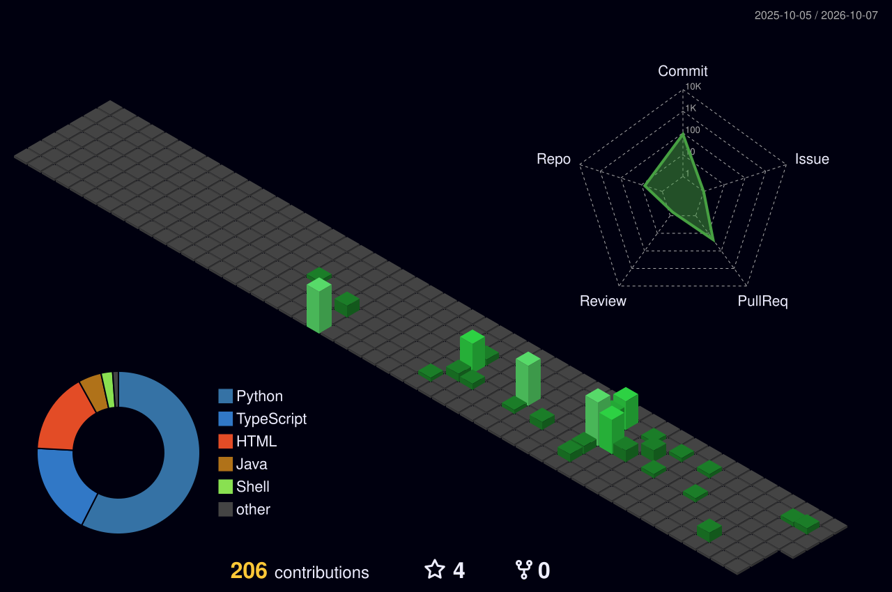

<!-- black-astro · GitHub Profile README -->

 

 

  

---

### 안녕하세요, 발송 서버를 만드는 6년차 백엔드 개발자 김현우입니다.

공공기관 안내문을 SKT PASS, 카카오, KT 문자로 보내는 서버를 Java·Spring Boot와 Tibero·Oracle로 개발하고 운영합니다.
자세한 이야기는 [블로그](https://black-astro.github.io/black-astro/)에 정리하고 있습니다.

---

### 주요 작업

| 프로젝트 | 기간 | 역할 | 한 줄 정리 |
|:---|:---|:---|:---|
| **SKT PASS 전자고지 발송 서버** | 2025.05 ~ 현재 | 3명 중 주 개발자 | 테스트를 먼저 만들고 운영 중 리팩터링, 스케줄러 1,042줄 → 약 260줄 · 중복 발송 0건 |
| **카카오 전자문서 발송 서버** | 2023.07 ~ 2023.12 | 혼자 구축, 현재 운영 | 초당 200건 제한에 맞춘 발송 속도 조절, 아침 2~3만 건을 2.5~3분에 분산 |
| **KT 청구서 대용량 배치** | 2023.04 ~ 현재 | 혼자 설계·개발 | 델파이 → Java 21, 4시간 50분 → 약 31분(개발 환경 측정) · 파일당 44초 → 0.8초 |
| **GibisbizCenter 플랫폼** | 2022.08 ~ 현재 | 혼자 개발·운영 | 백엔드 하나에 클라이언트 3종, SecurityFilterChain 분리 · Kotlin 이전 준비 중 |
| **iM라이프 발송 엔진** | 2023.01 ~ 2023.04 | 신규 구축, 주 개발자 | 구축부터 유통증명까지 5단계 스케줄러 파이프라인 |

회사 코드는 비공개라 자세한 내용은 [블로그의 회사에서 한 일](https://black-astro.github.io/black-astro/#/career)에 정리했습니다.

---

### 직접 만든 것

| 이름 | 한 줄 소개 |
|:---|:---|
| [**easy-quartz**](https://github.com/black-astro/easy-quartz) | 어노테이션 하나로 Quartz/Spring 스케줄을 쓰는 Spring Boot Starter · Maven Central 0.0.2 |
| [**smart-msg**](https://github.com/black-astro/smart-msg) | 변경 내용을 읽고 커밋 메시지를 제안하는 CLI · npm 1.3.0 |
| [**claude-statusline-astro**](https://github.com/black-astro/claude-statusline-astro) | Claude Code 상태줄 플러그인 · Windows·macOS·Linux |
| [**code T**](https://github.com/black-astro/coding-test) | 4개 언어 자동 채점이 되는 코딩테스트 연습 데스크톱 앱 · PySide6 |

---

  

  

